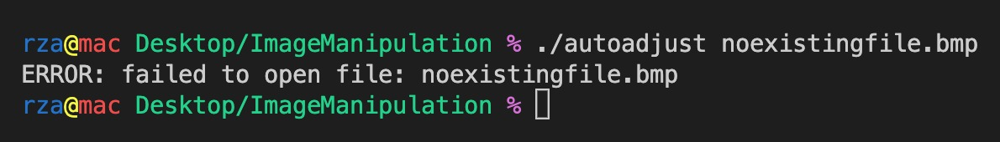
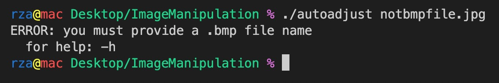
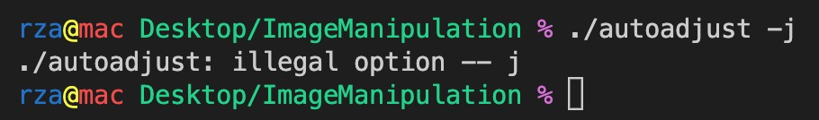
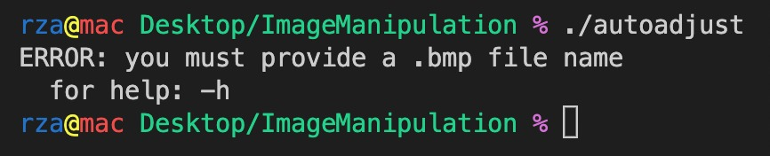
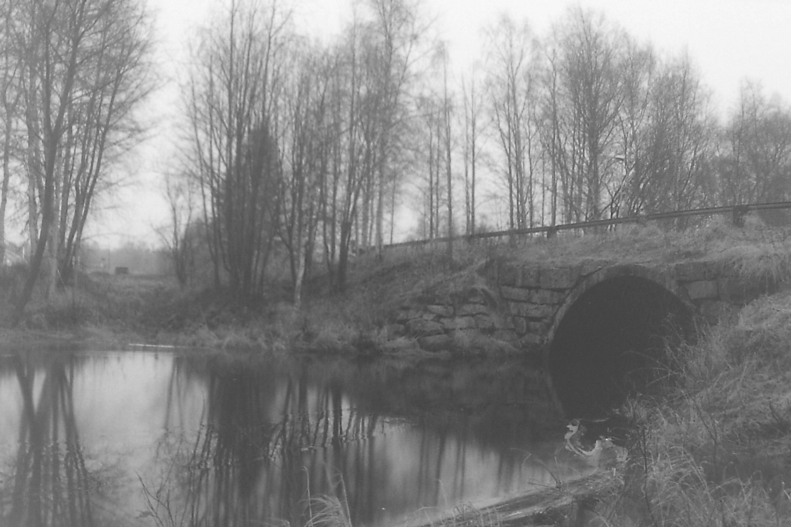
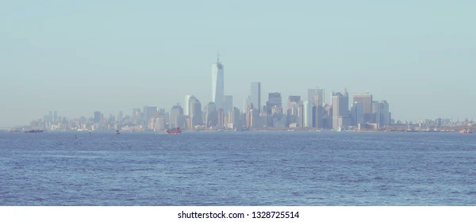
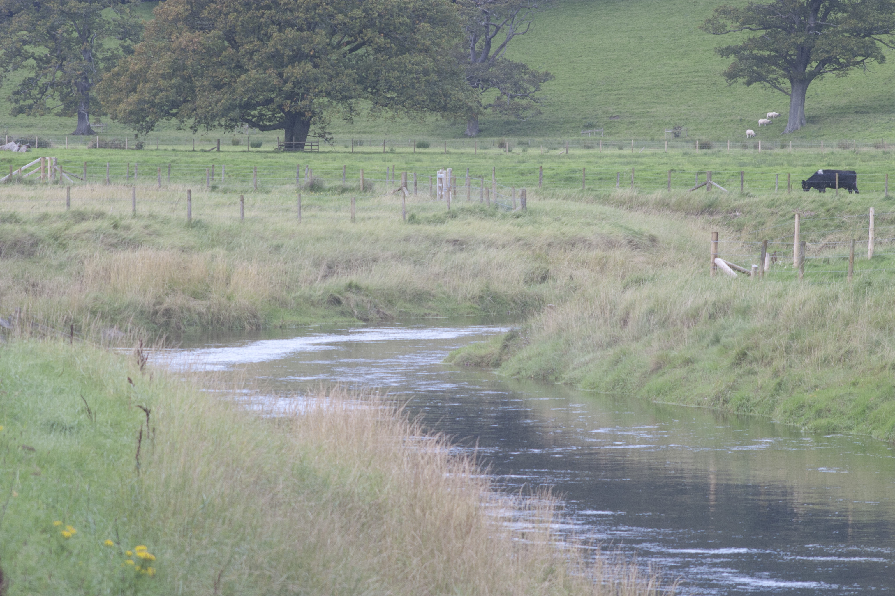
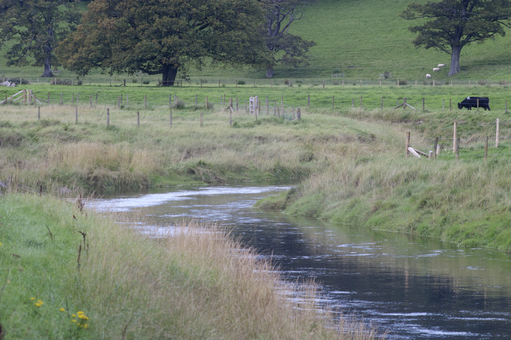
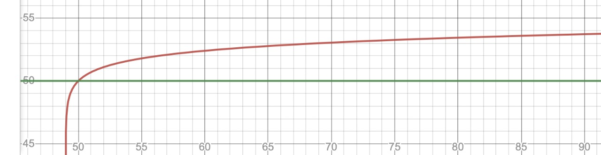

# Image Processing - Auto Brightness Contrast Adjuster

Collabarator: [Mikayil Shahtakhtinski](https://github.com/mshahcode)

## Introduction

The main idea of this project was to create the automatic adjusting brightness and contrast program. The program takes a BMP image as an input, do image manipulations on it and based on the user will, either writes it to standard output or creates a new processed image.

## User Manual

### Compiling

In order to run the program properly, the user starts a terminal section at the root folder of the project. The user then complies the program using command line: 

`gcc autoadjust.c -o autoadjust -O3 -Wall -lm`

-O3 for optimisations and -Wall to see all warnings if there is any

### Command Line Interface

There are several commands line that are being provided to the user.

1.  Help Command ( -h ) `./autoadjust -h` : a help information for the user to run the program properly
2. Taking image name as cmd line arg `./autoadjust image.bmp` : user should enter a bmp image as input. The processed image will be written to the stdout by default. The new processed image can be written to new empty image file via: 
  `./autoadjustimage.bmp > image2.bmp`
4. Output File Option (-o filename) `./autoadjust image.bmp -o image2.bmp`: program will read the `image.bmp` and after processing it the result will be written in `image2.bmp`

## Error Handling

If the *__input file__* doesn’t exist, the corresponding error message will be displayed in the terminal.

If the *__input file__* is not a BMP format, the corresponding error message will be displayed on the console.

If the *__flag input__* is not a valid one, the corresponding error message will be displayed on the console.

If there is no *__cmd line input__*, the corresponding error message will be displayed on the console.

## Example Image Results

 

  

  

## Logarithmic Brightness Transformation

The main idea of this project was to create the automatic adjusting brightness and contrast program. The program takes a BMP image as an input, do image manipulations on it and based on the user will, either writes it to standard output or creates a new processed image. While shifting the brightness of image in order to do it naturally a logarithmic formula has been used.

`newValue = oldValue - (minValue + ln(1 + oldValue - minValue)`

as an example for a min value of 50 the graph of subtracted value

## Conclusion

During this project, a lot of techniques were implemented and useful skills were acquired.

* Handling and doing manipulations on BMP images, understanding BMP file structure.
* Understanding and using big little-endian values.
* Using Union data types for converting little-big endians.
* Managing files : opening / reading / writing
* Creating a command line interface
* Understanding how brightness and contrast of image works and how to manipulate it
* Error handling for file managing image processing and command line interface
